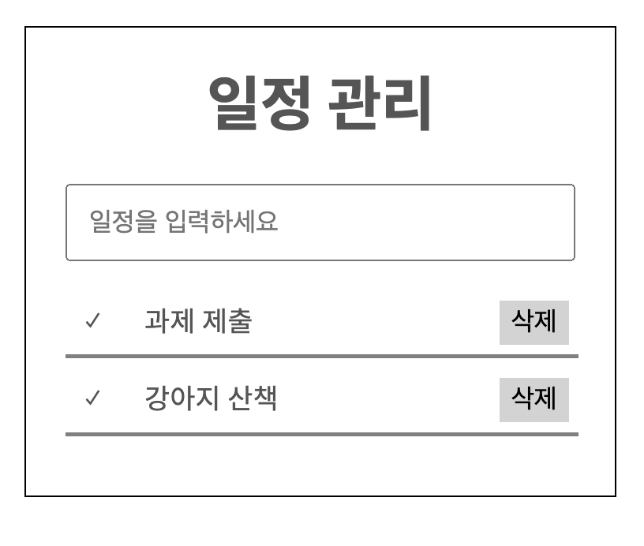
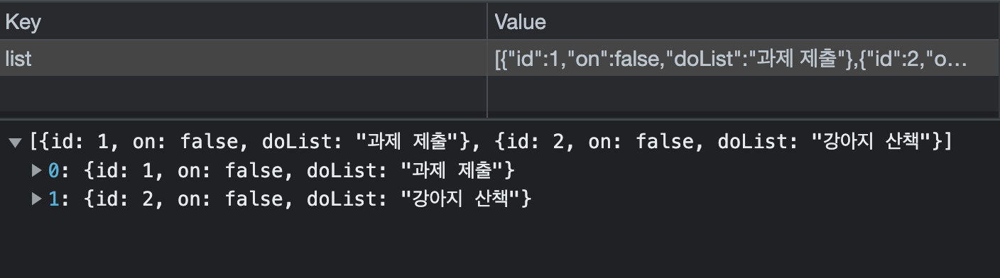
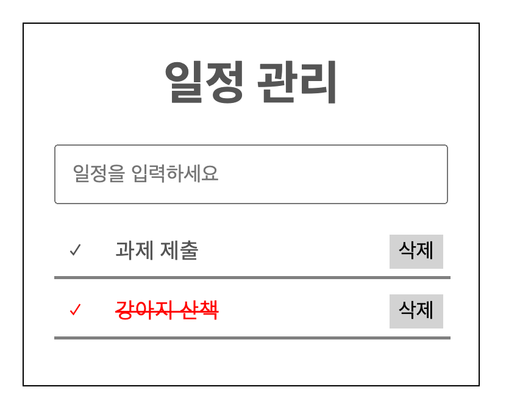
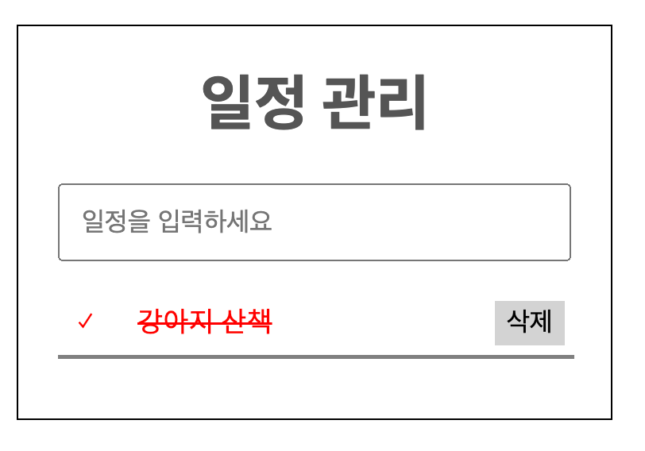

# localStorage-assignment

1. ## localStorage
   - localStorage를 사용하면 key와 value값을 Storage에 저장할 수 있다.
   - 저장한 데이터는 세션간 공유가 가능하다.
   - 기존에 배웠던 방식으로 데이터를 추가하면 새로고침 시 초기화 되었으나 localStorage를 사용함으로써 데이터 유지가 가능하다.

2. ## localStorage 사용법
    - localStorage.setItem('key', 'value')
    - localStorage.getItem('key')
    - localStorage.removeItem('key')
    - localStorage.clear() 전체 제거
    - localStorage.key( index )
    - localStorage.length
3. ## localStorage 예제
    - 구현 기능
    1. submit시 input.value값 리스트에 추가(localStroage에 저장될 것)
        
        
    2. V 체크 클릭 시 색 변경 및 취소선
        
    3. 삭제 버튼 클릭 시 해당 리스트 삭제
        

    - ver1
    html script에 전부 작성
    ```javascript
        <script>
        // localStorage.clear();

        const txt = document.querySelector('.input');
        const form = document.querySelector('form');
        const ul = document.querySelector('ul');
        let list = [];
        let no = 0;

        list = JSON.parse(localStorage.getItem("list")) || [];

        // delete
        const del = (delBtn, id) => {
            delBtn.addEventListener('click', e => {
                list = list.filter(item => item.id != id)
                localStorage.setItem("list", JSON.stringify(list))
                show();
            })
        }

        // done
        const done = (check) => {
            check.addEventListener('click', e => {
                e.target.parentElement.classList.toggle('on')
                console.log(e.target.parentElement.dataset.id);
                list.forEach(ele => {
                    if (ele.id == e.target.parentElement.dataset.id) {
                        ele.on = !ele.on;
                    }
                })
            })
        }

        // show
        const show = () => {
            ul.innerHTML = '';
            list.forEach((ele, idx) => {
                const { id, doList } = ele;
                let li = document.createElement('li');
                let check = document.createElement('i');
                let span = document.createElement('span');
                let delBtn = document.createElement('button');

                check.textContent = '✓';
                span.textContent = doList;
                delBtn.textContent = '삭제';

                li.dataset.id = id
                li.append(check);
                li.append(span);
                li.append(delBtn);
                if (ele.on) {
                    li.classList.add('on')
                    ul.append(li);
                } else {
                    ul.append(li);
                }

                del(delBtn, id);
                done(check)

            });
            txt.value = '';
            txt.focus();
        }

        // add
        const add = () => {
            list = [
                ...list,
                {
                    id: ++no,
                    on: false,
                    doList: txt.value
                }
            ]
            localStorage.setItem("list", JSON.stringify(list))
        }

        form.addEventListener('submit', e => {
            if (txt.value) {
                e.preventDefault();
                add();
                show();
            }
        })
        show();

    </script>
    ```
    - 새로운 리스트가 추가될 때 마다 list의 모든 객체를 다시 출력해주므로 기존에 체크표시가 된 리스트(li.on)들은 갱신이 될 때마다 초기화 되어 on class가 사라지게 된다.
    ```javascript

        // add 함수
        list = [
            ...list,
                {
                id: ++no,
                on: false,
                doList: txt.value
                }
        ]

        // show 함수
        li.dataset.id = id
        li.append(check);
        li.append(span);
        li.append(delBtn);
    ```
    이를 해결하기 위해 새로운 리스트를 객체에 추가할 때 on class의 존재 유무를 알려주는 on값을 추가해 주고 li 생성시 data-id를 추가했다.
    ```javascript
        // done 함수
        list.forEach(ele => {
            if (ele.id == e.target.parentElement.dataset.id) {
            ele.on = !ele.on;
            }
        })
    ```
    그 후 체크 버튼을 클릭하면 해당 리스트의 id값과 버튼의 부모 요소인 li의 data-id값이 같을 경우 on class가 add 되었다는 상태를 알 수 있도록 ( on : false -> on : true ) 변경해 준다.
    ```javascript
        // show 함수
        if (ele.on) {
            li.classList.add('on')
            ul.append(li);
        } else {
            ul.append(li);
        }
    ```
    show함수 실행 시 on의 불린값이 true인 경우 on class를 add해 준 뒤 append를 하기 때문에 초기화 되지 않는다.

    - ver2 
    class 사용
    외부에서 받을 값은 객체 밖에 없으므로 constructor를 list만 받았다.
    ```javascript
        <script>
        // localStorage.clear();

        const txt = document.querySelector('.input');
        const form = document.querySelector('form');
        const ul = document.querySelector('ul');
        let list = [];
        let no = list.length;

        list = JSON.parse(localStorage.getItem("list")) || [];

        class Todo {
            constructor(list) {
                this.list = list;
            }

            init() {
                this.show();
                form.addEventListener('submit', e => {
                    if (txt.value) {
                        e.preventDefault();
                        this.add();
                        this.show();
                    }
                })
            }

            show() {
                ul.innerHTML = '';
                list.forEach((ele, idx) => {
                    const { id, doList } = ele;
                    let li = document.createElement('li');
                    let check = document.createElement('i');
                    let span = document.createElement('span');
                    let delBtn = document.createElement('button');

                    check.textContent = '✓';
                    span.textContent = doList;
                    delBtn.textContent = '삭제';

                    li.dataset.id = id
                    li.append(check);
                    li.append(span);
                    li.append(delBtn);
                    if (ele.on) {
                        li.classList.add('on')
                        ul.append(li);
                    } else {
                        ul.append(li);
                    }

                    this.del(delBtn, id);
                    this.done(check)

                });
                txt.value = '';
                txt.focus();
            }

            del(delBtn, id) {
                console.log('del');
                delBtn.addEventListener('click', e => {
                    console.log('del');
                    console.log(id);
                    console.log(list);
                    list = list.filter(item => item.id != id)
                    localStorage.setItem("list", JSON.stringify(list))
                    this.show();
                })
            }
            // add
            add() {
                list = [
                    ...list,
                    {
                        id: ++no,
                        doList: txt.value
                    }
                ]
                localStorage.setItem("list", JSON.stringify(list))
            }
            // done
            done = (check) => {
                check.addEventListener('click', e => {
                    e.target.parentElement.classList.toggle('on')
                    console.log(e.target.parentElement.dataset.id);
                    list.forEach(ele => {
                        if (ele.id == e.target.parentElement.dataset.id) {
                            ele.on = !ele.on;
                        }
                    })
                })
            }
        }
        const todo = new Todo(list)
        todo.init();
    </script>
    ```
    - ver3
    module 사용
    Todo class에서 필요한 매개변수는 list, no, txt, form, ul이므로 호출시 매개변수로 넣어주고 외부 값을 받는 class의 constructor에도 추가해 주었다.
    ```javascript
    // getEle.js
    export function get(target) {
    const ele = document.querySelector(target);
    if (ele) {
        return ele;
    } else {
        throw Error('선택한 요소가 존재하지 않습니다.');
    }
    }
    export function getAll(target) {
        const ele = document.querySelectorAll(target);
        if (ele) {
            return ele;
        } else {
            throw Error('선택한 요소가 존재하지 않습니다.');
        }
    }
    ```
    ```javascript
    // show.js
    
    export class Todo {
        constructor(list, no, txt, form, ul) {
            this.list = list;
            this.no = no;
            this.txt = txt;
            this.form = form;
            this.ul = ul;
        }

        init() {
            console.log('init');
            this.show();
            this.form.addEventListener('submit', e => {
                if (this.txt.value) {
                    e.preventDefault();
                    this.add();
                    this.show();
                }
            })
        }

        show() {
            console.log('show');
            this.ul.innerHTML = '';
            this.list = JSON.parse(localStorage.getItem("list")) || [];
            this.list.forEach((ele, idx) => {
                const { id, doList } = ele;

                let li = document.createElement('li');
                let check = document.createElement('i');
                let span = document.createElement('span');
                let delBtn = document.createElement('button');

                check.textContent = '✓';
                span.textContent = doList;
                delBtn.textContent = '삭제';

                li.dataset.id = id
                li.append(check);
                li.append(span);
                li.append(delBtn);
                if (ele.on) {
                    li.classList.add('on')
                    this.ul.append(li);
                } else {
                    this.ul.append(li);
                }

                this.del(delBtn, id);
                this.done(check)

            });
            this.txt.value = '';
            this.txt.focus();
        }

        del(delBtn, id) {
            console.log('del');
            delBtn.addEventListener('click', e => {
                this.list = this.list.filter(item => item.id != id)
                localStorage.setItem("list", JSON.stringify(this.list))
                this.show();
            })
        }
        // add
        add() {
            console.log('add');
            this.list = [
                ...this.list,
                {
                    id: ++this.no,
                    doList: this.txt.value
                }
            ]
            localStorage.setItem("list", JSON.stringify(this.list))
        }
        // done
        done = (check) => {
            check.addEventListener('click', e => {
                console.log('done');
                e.target.parentElement.classList.toggle('on')
                this.list.forEach(ele => {
                    if (ele.id == e.target.parentElement.dataset.id) {
                        ele.on = !ele.on;
                    }
                })
            })
        }
    }
    ```
    ```javascript
    // app.js
    import { get, getAll } from './getEle.js';
    import { Todo } from './show.js';

    let list = [];
    let no = list.length;

    const txt = get('.input');
    const form = get('form');
    const ul = get('ul');

    list = JSON.parse(localStorage.getItem("list")) || [];

    const todo = new Todo(list, no, txt, form, ul)
    todo.init();

    form.addEventListener('submit', e => {
        console.log('submit');
        if (txt.value) {
            e.preventDefault();
            add();
            show();
        }
    })
    ```
